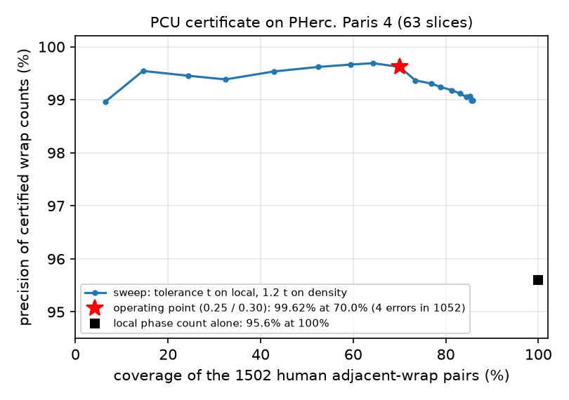
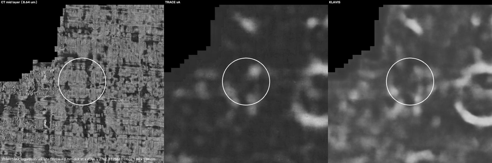
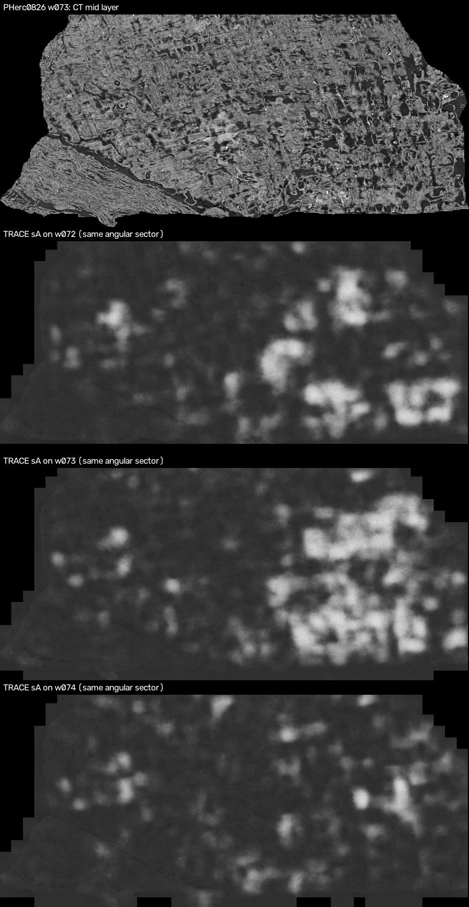
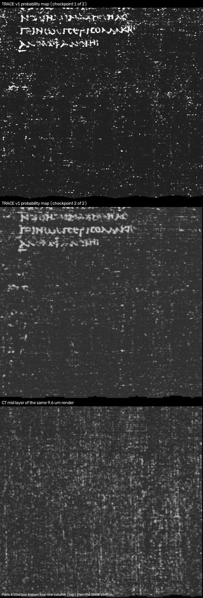

# vesuvius-scrolling

Tools for the Vesuvius Challenge by Jashanjot Singh Gill ([@Jashann](https://github.com/Jashann)) and Nhat Nam Tran ([@nnm2602](https://github.com/nnm2602)), September 2026.

## The problem

The scrolls that are still unread are scanned at 8.64 to 9.36 um per voxel. At that resolution two things are hard: telling **which wrap of the rolled papyrus** a point belongs to (the spiral fit needs *winding constraints*, and the organisers' own note is that constraints at roughly 93% accuracy make the fit worse than none), and **seeing ink**, because at four times coarser than the 2.4 um scans the ink model was distilled from, ink is a faint change of surface texture, not a density.

## What we built

1. **PCU, certified automatic winding constraints.** Lasagna (the organisers' sheet model) predicts `cos(2 pi w)` where `w` is the wrap coordinate. We treat that channel as a wrapped phase and count the wraps between two points in three ways from that one prediction (local phase cycles, an integral of wrap density, and a whole-slice unwrapped field). A count is *certified* only when all three agree; a fourth vote from a different model (the recto-surface net) gives a *gold* tier. On PHerc. Paris 4, against all **1,502** human adjacent-wrap pairs (63 slices), certified counts are **99.62% correct at 70% coverage** (4 errors in 1,052; 95% Wilson lower bound 99.0%; the best single measurement alone is 95.6%), and the gold tier of generated steps is **942 / 942** against human ladders (lower bound 99.6%; the gold tier keeps 59% of certified steps). Fed to the organisers' spiral fitter as relative-winding constraints they cut winding slips per wrap on Paris 4 from **20.3% to 9.3%** (fully automatic fit, 32 held-out human ladders; ladder-level bootstrap CI 6.2 to 12.7%; paired difference 11 points, CI 7 to 16) and on the eligible scroll PHerc0826 from **50.1% to 36.3%** measured against PCU's own gold ladders on held-out slices. Details: [`docs/PCU_REPORT.md`](docs/PCU_REPORT.md).

2. **TRACE, an ink detector trained on the eligible-protocol scans.** The organisers' `ink_9um` model fine-tuned on their *real* 9.362 um surface volumes (PHerc0139, PHerc0814) with their 2.4 um ink predictions on the same meshes as soft targets, then extended (v3) with the 8.64 um and 9.362 um fragment scans (PHerc0009B, PHerc0343P, PHerc0500P2). On PHerc0841, a scroll no checkpoint was trained on, against the organisers' human ink labels, AUC rises from **0.705 to 0.747** (released model) to **0.837 to 0.868** (v3B). Checkpoints were *selected* on those same segments; the disclosure and the failure modes are in [`docs/TRACE.md`](docs/TRACE.md) and [`MODEL_CARD.md`](MODEL_CARD.md).

Around them: a survey pipeline for eligible scrolls (spiral fit, snap to the m7 surface, ARAP flatten, native render, detector ensemble), an umbilicus estimator for the scrolls that have none, a hotspot vetting protocol (depth profile, neighbouring-sheet control, lattice test), a positive-control harness at the organisers' PHerc1447 ink site, and the negative results (they cost real compute and may save yours).

## Results

| What | Baseline | This work |
|---|---|---|
| Winding count precision, Paris 4, 1,502 human adjacent pairs, at 70% coverage | best single measurement 95.6% | **99.62%** (4 errors in 1,052; 95% lower bound 99.0%) |
| Same, densest bands (wrap spacing below 173 um) | | **100%** (529 pairs, 33 to 71% covered) |
| Generated steps, gold tier (4 votes), matched to human ladders | | **942 / 942** (lower bound 99.6%; 59% of certified steps) |
| Spiral fit slips per wrap, Paris 4, fully automatic, 32 held-out human ladders | 20.3% (CI 17.0 to 24.9) | **9.3%** (30 / 324; CI 6.2 to 12.7); selection-free 10.2% (CI 6.6 to 15.6) |
| Spiral fit slips per wrap, PHerc0826, against PCU gold ladders on 8 held-out slices (not human labels) | 50.1% (CI 48.5 to 51.8) | **36.3%** (CI 34.8 to 37.9) |
| Ink AUC vs human labels, PHerc0841 w00 / ag144 / ag174 (never trained on; used for checkpoint selection) | 0.747 / 0.736 / 0.705 | v3B **0.868 / 0.862 / 0.837**; sB 0.857 / 0.839 / 0.817 |
| Ink AUC, PHerc0139 w043 vs the organisers' 2.4 um map (teacher) | 0.782 | 0.899 |
| Ink AUC, PHerc0139 w043 vs sparse human labels | 0.82 | 0.745 to 0.789 (fine-tunes inherit the teacher's errors) |

Definitions. A *ladder* is a human-clicked line of points across consecutive wraps in one slice; a *slip* is one adjacent pair the fitted surfaces assign to the wrong wrap difference; *slips per wrap* is slips over pairs. Fit CIs are 95% ladder-level bootstraps (2,000 resamples, pairs kept within their ladder), from `exp/e31b_bootstrap.py` on the released fit grids; *selection-free* picks the constraint weight on a random half of the ladders and scores the pick on the other half (200 splits). The Paris 4 sweep is one seed per weight. *Gold ladders* are PCU-generated ladders on slices no fit saw; the PHerc0826 row therefore measures agreement with PCU, not with a human. *Lasagna*, *m7* and the recto model are the organisers' sheet-prediction networks; *p95* is the 95th percentile of an ink map over a window; *ARAP* is as-rigid-as-possible flattening.

The negative-set test that matters for a fit (does the certificate ever certify "1 wrap" across a missed sheet?) is `exp/e9b_negative.py`; its result is in `docs/PCU_REPORT.md` section 2 as soon as the run finishes. On PHerc0139, without retuning, the certificate accepts 5 to 8% of truly two-wrap pairs as one wrap (section 5 of the report).

Reproduce the ink table from public data in one command (`python eval_trace.py`, about 85 minutes on a T4 for 7 models x 4 segments; the 10-minute check is `python eval_trace.py --models base,v3B --segments te1`, expected 0.747 and 0.868). The winding certificate: `python exp/e9_certificate.py` (laptop, 15 minutes, writes `runs/e9_rows.json`; the copy we ran is `results/e9_rows.json`). The fit numbers: `python exp/e31b_bootstrap.py` on the grids from release v1.1.

### Figures

| | |
|---|---|
|  |  |
| PCU certificate on Paris 4: precision of certified wrap counts against the 1,502 human pairs as the agreement tolerance is swept; the star is the operating point used everywhere (tolerances 0.25 / 0.30), the square is the local phase count alone. | Positive control at the organisers' PHerc1447 ink site (circle = 3 mm disk at the reported coordinates; 1.04 cm crops at 8.64 um): CT mid layer, TRACE sA, KLAVIS. Every public detector responds only weakly, and the ring at the right is a void edge, not ink. |
|  |  |
| Why hotspots must be vetted: the text-range response on PHerc0826 w073 (right half) is present on the neighbouring wraps w072 and w074 in the same angular sector, so it is regional texture, not one sheet's ink. | Paris 4 title box rendered at 9.6 um: two TRACE v1 maps (sA, sB) and the CT mid layer. The known four-line column at the top passes (positive control); the blank stretch below shows nothing to any detector. |

## Setup

Python 3.12. Install `torch` for your platform, then:

```bash
pip install -r requirements.txt
git clone -b merge-ink-pipelines https://github.com/ScrollPrize/villa.git ext/villa-ink && git -C ext/villa-ink checkout 3ea17f5   # koine_machines (ink models)
git clone https://github.com/ScrollPrize/villa.git ext/villa && git -C ext/villa checkout 6bbe6e2                                   # vesuvius.image_proc, fit_spiral
mkdir -p data/cache/checkpoints && curl -L -o data/cache/checkpoints/v3B.pth https://github.com/Jashann/vesuvius-scrolling/releases/download/v1.0/v3B_best.pth
```

All scroll data is read straight from the Vesuvius Challenge open-data bucket through `pcu.data` (chunk cache in `$PCU_CACHE`, default `data/cache`).

Release assets: [v1.0](https://github.com/Jashann/vesuvius-scrolling/releases/tag/v1.0) holds the checkpoints (`v3B_best.pth`, `v3A_best.pth`, `sB_best.pth`, `sA_best.pth`; ink_9um format) and the large constraint files (`pcu_relative_windings_PHercParis4_gold.json`, 377k gold pairs; `pcu_gold_0125.json`); [v1.1](https://github.com/Jashann/vesuvius-scrolling/releases/tag/v1.1) holds the spiral-fit output grids behind every slip number. SHA256 of every asset: `MODEL_CARD.md` and `data/README.md`. Smaller files ship in `data/`.

## How to use

**Score any surface volume with TRACE** (rows along z, inner face first; 8.64 um scans: add `--resample 8.64`):

```bash
python -m pcu.trace_infer \
  https://dl.ash2txt.org/PHerc0841/segments/20260220213127-w00/surface-volumes/9.366um-1.2m-113keV-volume-20250821151531.zarr/0 \
  data/cache/checkpoints/v3B.pth out.png
```

or from Python: `from pcu.trace_infer import load_model, predict` (`predict(model, sv)` returns a probability map). `python eval_trace.py --save_maps` reproduces the held-out table (released ink_9um seeds 42 and 43, KLAVIS, all four TRACE checkpoints; three PHerc0841 segments and PHerc0139 w043) and writes the maps. Use v3B for 9.36 um segments; at 8.64 um (PHerc1447) no TRACE checkpoint beat the base model at the one known ink site.

**Certified winding constraints** (Paris 4, Lasagna L2 predictions from the bucket):

```bash
python exp/e11_generate.py <z_L3> 48            # one slice -> runs/constraints/pcu_z2_<z>.json
OUT=runs/constraints python exp/e13_band.py <z_lo> <z_hi> 2   # a z-band, gold and silver tiers
python exp/e9_certificate.py                     # precision / coverage on the human ladders
python exp/e9b_negative.py                       # the same on 2- and 3-wrap pairs (negative set)
python exp/e63_merge_gold.py out.json 'runs/constraints/*_gold.json'   # one VC3D point-collection file
```

The merged file loads into `fit_spiral.py` as an extra relative-winding document. The configuration that gave the 9.3% result (`kaggle/pcu-fit-b3/pcu_fit_b3.py`, run B3w10):

```python
input_use_pcl_relative=True,            # our file as relative_windings.json (integer collection keys,
                                        # "vc_pointcollections_json_version": "1")
input_use_verified_patches=False, input_use_winding_inference=False,   # fully automatic
sample_count_unattached_pcls_per_step=840,                             # 10x the default
loss_weight_unattached_pcl_radius=10.0, loss_weight_unattached_pcl_dt=10.0,
```

`kaggle/pcu-fit-auto/` (A2 baseline), `kaggle/pcu-fit-b/` (B2, default weight; B with verified patches) and `kaggle/pcu-fit-b4/` (weights 4/4 and 20/10) are the other runs of the sweep. Score any grid: `python exp/e31b_bootstrap.py human B3w10=<dir> --ref A2 --out out.json`.

**Fit, render and survey a scroll with no published umbilicus:**

```bash
python exp/e69_umb_band.py PHerc0813 11300 12300 umb_PHerc0813.json   # band umbilicus
# kaggle/pcu-fit-new/template.py: spiral fit with CW/ACW pilots, then TRACE on every 3rd winding
# (fill the SCROLL / Z0 / Z1 placeholders at the top of the template per job)
```

**Vet a hotspot** (depth profile, then the neighbouring wraps in the same angular sector), on a fit grid from release v1.1:

```bash
python exp/e73_vet.py PHerc0826 grids_PHerc0826_B1w20.npz w073 0.35 0.70 w072,w074 s0826w073
# scrolls without a published umbilicus: UMB_FILE=data/umbilicus/umb_band_PHerc0800.json python exp/e73_vet.py PHerc0800 ...
```

**Train TRACE:** `kaggle/pcu-trace-train/pcu_trace_train.py` (env `TRACE_MANIFEST`, `TRACE_NTRAIN`, `TRACE_MATCH_PX`) or `modal/trace_v3.py` for the exact v3 run (`runs/trace_manifest_v3.json`, 128 segments).

Scripts in `exp/` that load several checkpoints look for them under `runs/` and skip any that are missing; `v2A` (referenced by e71/e73/e90) was not released.

## Limitations

- **No letters were read.** Surveys of about 600 windings across PHerc0826, 0125, 0211, 0191, 0257, 0358, 0813, 0800, 1447 and 1203 produced text-range hotspots that all failed the neighbouring-sheet control (regional texture of crushed papyrus), except one sheet-specific but unreadable patch on PHerc0826. At the organisers' PHerc1447 ink site every public detector responds only weakly (81st to 97th percentile of a 1 cm crop, best of 20 settings per model; the released model ranks highest), so one site cannot rank detectors.
- **TRACE is a fine-tune selected on its held-out set.** About 8 runs, each evaluated about 8 times on the same four segments, with the layer order confirmed on them too. The v3 gain over v1 (0.01 to 0.02) is within that selection spread and is not claimed as real. Against sparse human labels on PHerc0139 w043 the fine-tunes score below the base model, and w043's neighbouring wraps are in the training set. The window statistic (p95) is a triage tool, not a text detector.
- **The certificate test set contains only true one-wrap pairs**, so it cannot show the error that hurts a fit most (certifying "1" across a missed sheet); `exp/e9b_negative.py` measures that on 2- and 3-wrap pairs, and on PHerc0139 the rate is 5 to 8% of two-wrap pairs. The tolerances (0.25 / 0.30) were chosen on the same 1,502 pairs; the 20 half-split calibration (99.64%) is the only guard.
- **Fit gains are single-seed runs** scored on 32 ladders in one band; the fit satisfies only about 45% of the constraint strips at its own tolerance. The PHerc0826 gain is measured against PCU's own ladders on held-out slices and the weight was chosen on that set (the selection-free number is the same, 36.4%, because w20 wins on 199 of 200 splits). The eligible-scroll fit remains far worse than Paris 4 (36% vs 9%).
- The whole-slice winding field is a diagnostic, not a replacement for the spiral fit (it jumps along sheets).

## Layout

`pcu/` library (`constraints.py`, `crestgraph.py`, `phase.py`, `slice2d.py`, `mcfcut.py` for PCU; `data.py`, `zarr3.py` for S3 access; `refine.py`, `flatten.py`, `render.py`, `survey.py`, `umbilicus.py`, `phasesurf.py`, `rowstack.py` for the survey; `trace_infer.py`). `exp/` experiment scripts, numbered as in our lab log. `kaggle/`, `modal/` the jobs exactly as run (Kaggle T4 x2, Modal L4). `docs/` reports and figures. `data/` constraint files and umbilici. `results/` the logs and metric files behind the numbers above (`results/fit/fit_logs_excerpt.txt` shows which runs loaded constraints). `runs/` training manifests.

## Credits and licence

Built on the organisers' work: Lasagna and the recto/m7 surface models, `ink_9um` (the base model and its `koine_machines` inference code), hecate, `fit_spiral.py`, the tracks, umbilici and `vc_gen_umbilicus` objective, `vc_render_tifxyz`, and the human winding and ink annotations. KLAVIS (domenicor046/ink9um-dense) was used as a comparison detector. Data: Vesuvius Challenge open data.

Code MIT. Model weights, constraint files and everything else derived from scroll data: CC BY-NC-SA 4.0, because the scroll data and the organisers' model weights are released under the Vesuvius Challenge data agreement (non-commercial, share-alike) and derived works keep those terms (see `LICENSE`).
